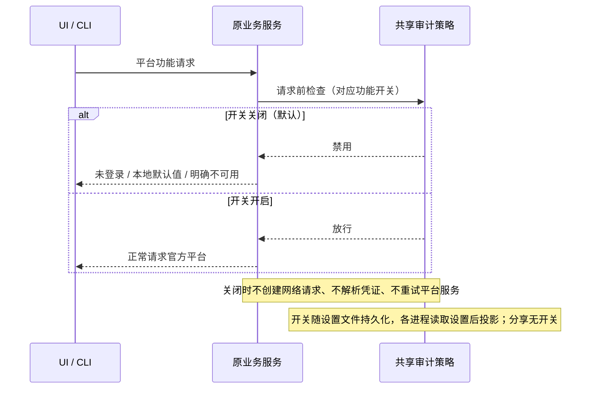

# ZCodium：官方平台断连

审计版默认不连接官方平台。OAuth 登录、刷新、用户资料及远端登出、对话分享、反馈、套餐和额度、官方 MCP 凭证、闲时任务网关、客户端配置和内置模型远端配置默认在请求前短路。反馈指向 https://github.com/ZCodium-project/ZCodium/issues。对话分享永久下线，任何开关都不能恢复；其余功能只在用户在设置 → “Z.AI 服务”里显式打开对应开关后连接，不能由环境变量、已保存凭证或 endpoint 设置隐式开启。开关的持久化与进程投影见 [official-service-switches.md](../../services/specs/official-service-switches.md)。

共享纯策略为唯一禁用规则；各业务服务保留接口、类型和原有本地数据所有者。OAuth 展示未登录，不删除历史用户数据。无新业务状态、队列或持久化迁移；桌面连续流与手机可恢复流保持现有 Host/lease 所有权。

用户自配模型 URL、密钥、代理和本地功能保持可用；CLI 不再把模型 URL 改写至官方 Coding Plan 网关。官方 CDN 默认市场和图片改为无远端来源，网络边界拒绝历史缓存中的官方平台地址。用户主动打开系统浏览器的文档链接不受此策略限制。

验收：源码 grep 风格回归扫描主动域名和网络出口；使用会在被调用时失败的网络替身验证 no-op；验证用户模型 URL 和请求参数不被修改；官方服务开关回归（`packages/desktop/tests/official-service-switches.test.mjs`）验证设置持久化、跨进程投影及开关放行；运行桌面 no-telemetry 回归、pnpm typecheck、pnpm lint、架构检查。实际 Electron 启动抓包若未执行必须明确说明。
